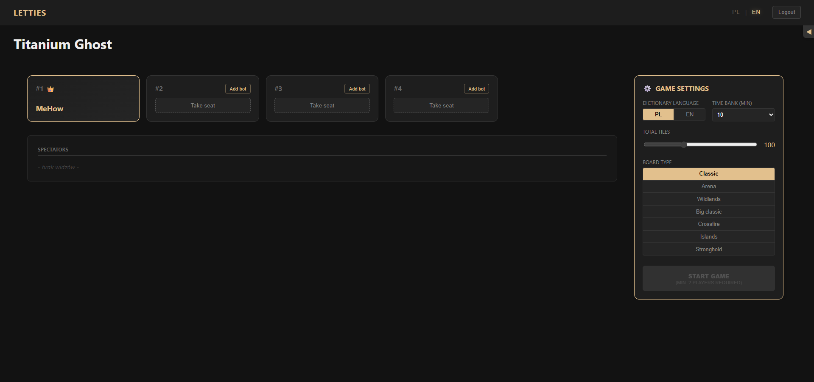
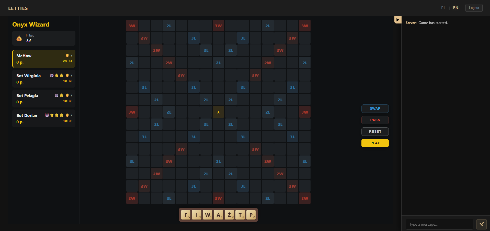
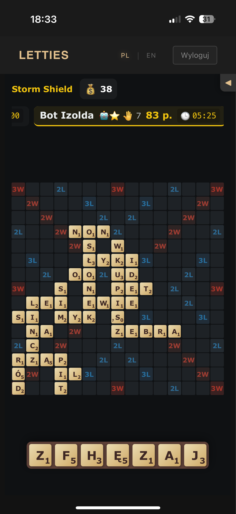

# Letties - Real-Time Multiplayer Word Game


## 🚀 Overview

**Letties** is a high-performance, real-time multiplayer word game inspired by Scrabble. Built with a modern **Angular** frontend and a **.NET** backend, it leverages **SignalR** WebSockets to provide instant state synchronization across all connected clients.

This project serves as a showcase of complex state management, real-time communication patterns, and responsive UI design capable of handling complex drag-and-drop interactions on both desktop and mobile devices.

---

## 🛠️ Tech Stack

### Frontend (Angular)
*   **Core:** Angular 18+ (Standalone Components).
*   **State Management:** **Angular Signals** for granular, high-performance reactivity.
*   **Interaction:** `@angular/cdk/drag-drop` with custom logic for grid-snapping and validation.
*   **Styling:** SCSS with responsive layouts (CSS Grid/Flexbox) and specific mobile optimizations.
*   **Internationalization:** `@jsverse/transloco` for dynamic language switching (EN/PL).
*   **Build:** Dockerized Nginx setup.

### Backend (.NET)
*   **Framework:** ASP.NET Core Web API.
*   **Real-time:** **SignalR Hubs** (`GameHub`, `LoginHub`) for bidirectional communication.
*   **Architecture:** Clean Architecture principles.
*   **Protocol:** Strong-typed events for game state updates (Lobby, Game Start, Move Validation).

### DevOps & Infrastructure
*   **Containerization:** Full Docker support for both frontend and backend.
*   **Orchestration:** Docker Compose for local development and deployment.

---

## 🌟 Key Technical Features

### 1. Real-Time State Synchronization
Unlike traditional polling-based games, Letties pushes updates instantly.
*   **Optimized Payload:** Only specific deltas (e.g., `placedTiles`, `scores`) are broadcasted to minimize bandwidth.
*   **Latency Handling:** Optimistic UI updates are used for local tile movement, confirmed asynchronously by the server.

### 2. Mobile Resilience & Connectivity
Mobile browsers aggressively freeze background JavaScript contexts (especially iOS WebKit). To solve this:
*   **Aggressive Keep-Alive:** Custom SignalR configuration to detect "zombie" connections within seconds.
*   **Auto-Reconnection Strategy:** Proactive connection checks on `visibilitychange` events ensure the game state "catches up" instantly when the user unlocks their phone.
*   **Gesture-Based Permissions:** Manual triggers for browser features that require explicit user interaction constraints.

### 3. Advanced Drag & Drop Logic
*   **Hybrid Input:** Supports both mouse (desktop) and touch (mobile) interactions.
*   **Smart Validation:** Client-side pre-validation prevents illegal moves before they reach the server (e.g., checking connectivity to existing words).
*   **UX Polish:** Smooth CSS transitions that are disabled *during* drag operations to prevent layout trashing, re-enabled for snapping animations.

---

## 📸 Screenshots

| Lobby View | Gameplay (Desktop) | Mobile Interface |
|:---:|:---:|:---:|
|  |  |  |

---

## 🚦 Getting Started

### Prerequisites
*   Docker & Docker Compose
*   Node.js 20+ (for local frontend dev)
*   .NET SDK (for local backend dev)

### Running with Docker (Recommended)

The easiest way to spin up the entire stack:

```bash
# Clone the repository
git clone https://github.com/your-username/letties.git

# Navigate to root
cd letties

# Start services
docker-compose up -d --build
```

Access the application at `http://localhost:4200` (or the port defined in your compose file).

### Local Development

**Frontend:**
```bash
cd src/angular
npm install
npm start
```

**Backend:**
```bash
cd src/dotnet
dotnet run --project WebGame.Api
```

---

## 🔮 Future Roadmap

*   **PWA Implementation:** Full offline support and push notifications (Service Worker scaffolding is already in place).
*   **AI Opponents:** Enhanced bot difficulty levels using Minimax algorithm.
*   **Elo Ranking System:** Persistent player statistics and competitive matchmaking.

---

## 📄 License

This project is open-source and available under the MIT License.
